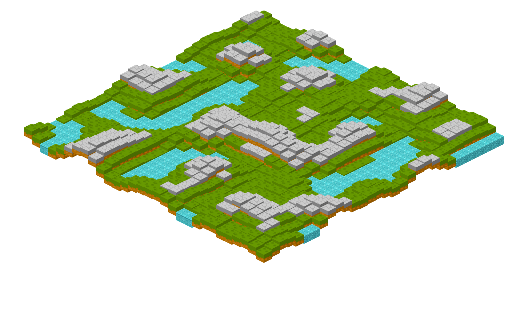
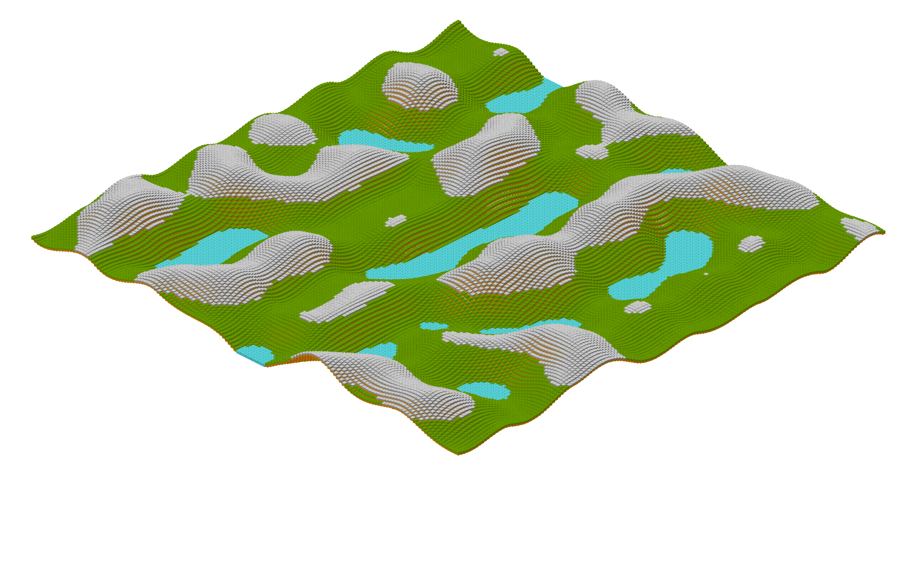

# terrain-generation
Random terrain generation with Perlin noise, using an isometric-type tileset.

## Examples
- 30 x 30 plane

- 100 x 100 plane

## Credits
- [Snowy and Grass tile](https://opengameart.org/content/basic-isometric-tiles-128x128)
- [Water tile](https://www.moddb.com/games/the-pits-battle-of-gods/images/based-isometric-water-tile)
